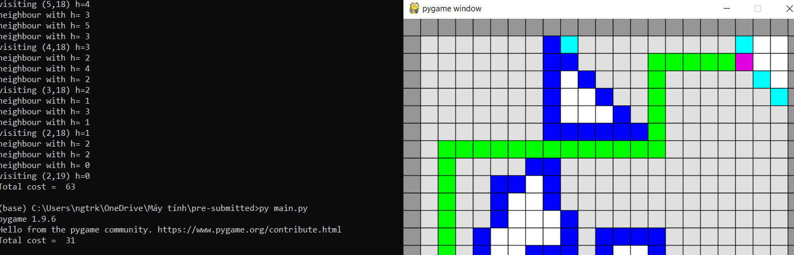
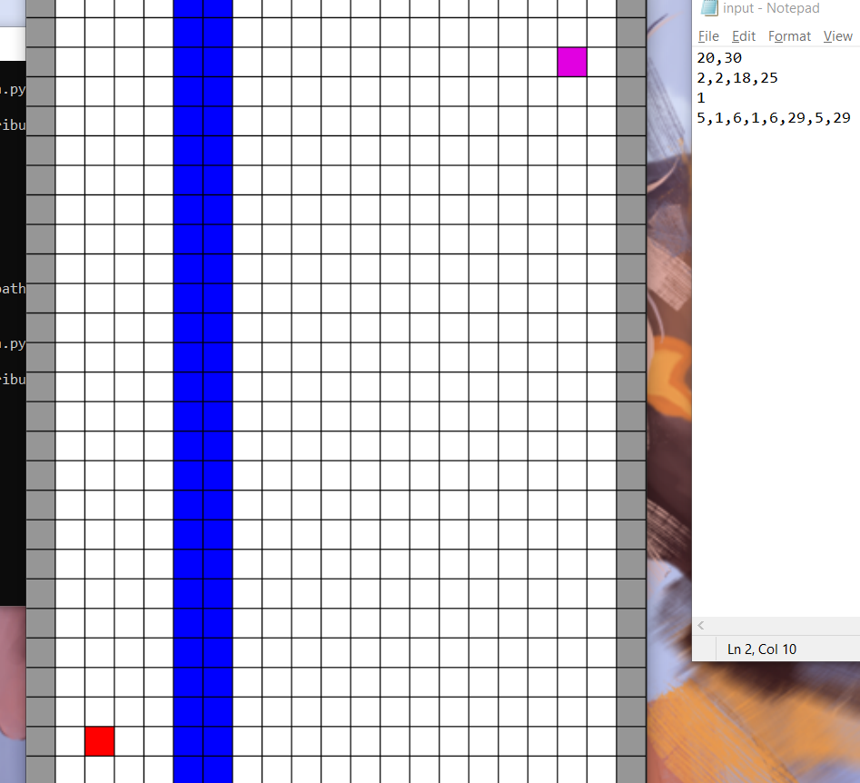
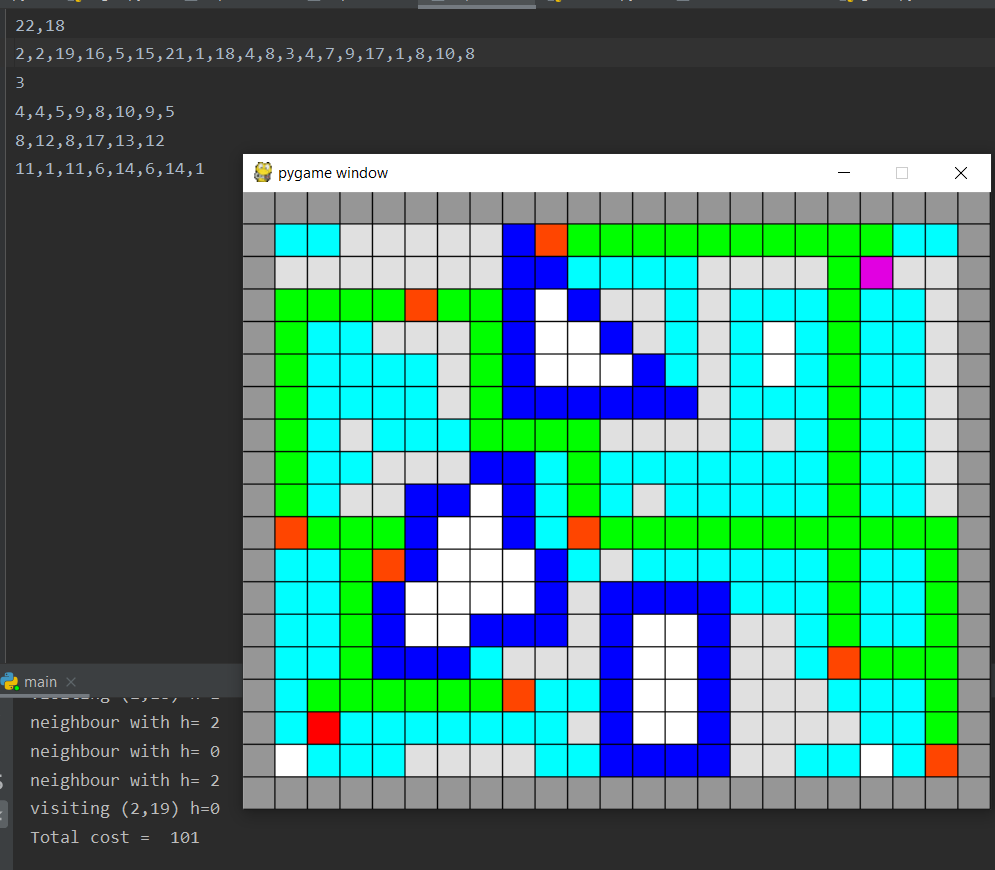

# Shortest path finding
This is a my school project (Introduction to Artificial Intelligence course), using blind search and heuristic algorithms to solve shortest path problem, written in Python language
# Input and Output
Input: 
 - The first line contains width and height of "space"
 - The second line contains Coordinates Sx, Sy, Gx, Gy and optionally, contains some must-pass points
 - The third line contains n, the number of polygons
 - The subsequent lines describe one polygon

Output: Find shortest path and make a pathfinding visualizer (this project uses Pygame package) 
# Section 1

Given 2 point S and G, find shorest path from S to G.

In this section we will implement 3 search algorithms:  
 - BFS
 - Greedy search 
 - A star (A*) search

# Section 2
Given 2 points S and G, and some must-pass points M, N,P, .... find shorest path rom S to G which visits these must-pass point.

In this section, we will use permutation to solve shortest path problem with multiple must-pass node.

# Screenshorts

# LICENSE
VNU-HCMUS - https://www.hcmus.edu.vn/
